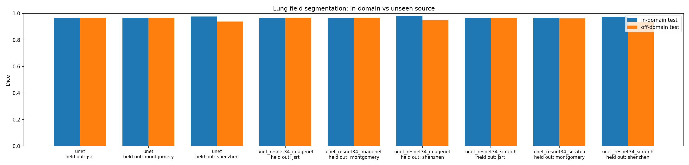
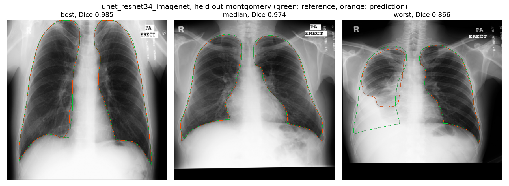
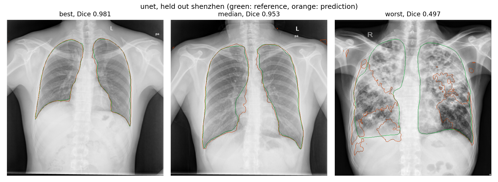
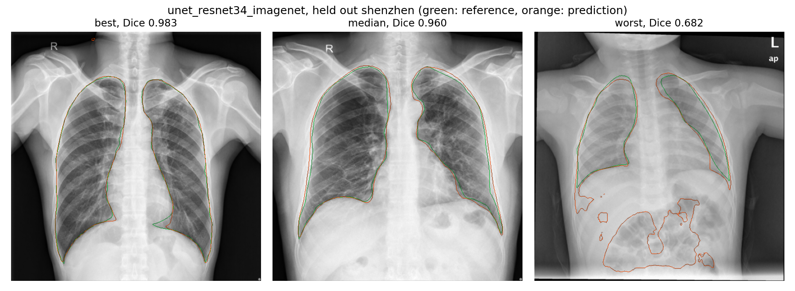

# Lung field segmentation across unseen chest X-ray sources

A leave-one-dataset-out study of how well a lung segmentation model trained on
two public chest X-ray sources holds up on a third it has never seen.

## Summary

Published lung segmentation scores are usually measured on a random split of a
single dataset, where the test images come from the same scanners and the same
population as training. This project measures something else: train on two
sources, test on a third that was held out entirely, and repeat so that each of
the three sources takes a turn as the unseen one.

The main finding is that the drop is small. Off-domain Dice stays between 0.93
and 0.97 across all three held-out sources. For two of the three folds the
held-out source is no harder than the in-domain test, and is sometimes slightly
easier. A real gap appears in only one configuration, when the Shenzhen set is
held out, and even there it is about 3 to 4 Dice points. So the honest headline
is not that cross-source transfer fails. On these three sources it mostly holds,
and the interesting question becomes why one fold behaves differently from the
other two.

Two secondary results come out of the same runs. First, boundary distance tells
a sharper story than Dice: on the Shenzhen fold the 95th-percentile Hausdorff
distance is three to four times larger than on the other folds, so a metric that
looks at the region overlap alone hides a boundary problem that a distance
metric exposes. Second, ImageNet pretraining gives a small but statistically
reliable improvement in off-domain Dice on every fold, largest on the hard one,
though the size of that improvement is modest.

## Data

Three public sources, one image per patient, 951 radiographs in total.

| Source | Images used | Origin | Mask provenance |
|---|---|---|---|
| Montgomery County | 138 | Maryland, USA | Manual, merged into one lung-field mask per image |
| Shenzhen | 566 | Shenzhen No. 3 People's Hospital, China | Manual masks contributed by a later annotation effort |
| JSRT | 247 | 13 institutions, Japan | SCR reference masks |

The Shenzhen mirror ships 662 radiographs but only 566 masks. The 96 images
without a segmentation cannot be trained on or scored, so this study uses the
annotated subset of 566. That count is declared in the data config and checked
at load time, so a mirror that quietly lost more masks would fail rather than
shrink the study without notice.

The images are read from community re-uploads on Kaggle, which are convenient
but are not the canonical distributions. Cite the original papers, listed at the
end, not the mirrors.

## Method

**Protocol.** Leave-one-dataset-out. For each held-out source, the other two are
pooled and split within each source into 70% train, 15% validation, 15%
in-domain test. The held-out source is the off-domain test. Splitting per source
before pooling keeps the class balance of the training pool stable across folds.
Every split is patient-level, and each source has one image per patient, so no
patient can appear in both a training and a test set.

| Held out | Train | Val | In-domain test | Off-domain test |
|---|---|---|---|---|
| JSRT | 492 | 106 | 106 | 247 |
| Montgomery | 569 | 122 | 122 | 138 |
| Shenzhen | 269 | 58 | 58 | 566 |

**Models.** Two architectures, and one of them in two initializations, giving
three arms:

| Arm | Encoder | Parameters | Initialization |
|---|---|---|---|
| `unet` | plain U-Net | 7.76M | random |
| `unet_resnet34_scratch` | ResNet34 U-Net | 24.45M | random |
| `unet_resnet34_imagenet` | ResNet34 U-Net | 24.45M | ImageNet |

The two ResNet arms are identical except for how the encoder is initialized, so
they are the only pair that isolates the effect of pretraining. Comparing the
plain U-Net against either ResNet arm changes the parameter count by about
three times as well, so those comparisons measure capacity and initialization
together and cannot attribute an effect to pretraining on their own. The
analysis keeps these two questions in separate families (see Results).

**Training.** Input resized to 512x512. Loss is the sum of Dice and binary
cross-entropy. Adam at learning rate 3e-4, weight decay 1e-4, cosine schedule,
up to 60 epochs with early stopping at patience 10 on validation Dice. Seed 42.

**Augmentation.** Deliberately mild: rotation up to 10 degrees, scale 0.9 to
1.1, translation up to 5%, and light intensity jitter. Horizontal flip is
excluded on purpose. Mirroring a chest radiograph puts the heart on the wrong
side, an anatomy the model should never be taught to accept as normal.

**Post-processing.** Predictions are scored twice, once raw and once after
keeping the two largest connected components. Two, not one, because the left and
right lung fields touch only near the mediastinum and a thresholded prediction
often separates them.

**Metrics.** Dice and IoU for region overlap, 95th-percentile Hausdorff distance
(HD95) and average symmetric surface distance (ASSD) for boundary agreement, all
computed per image from the saved predictions. The validation Dice that early
stopping selects on is not reported as a result, because it is the quantity the
checkpoint was chosen to maximize and is therefore optimistically biased.

## Results

### Generalization gap

Off-domain Dice minus in-domain Dice, per arm and fold, raw (not
post-processed). A positive gap means the held-out source is harder than the
in-domain test; a negative gap means it is easier.

| Arm | Held out | In-domain Dice | Off-domain Dice | Gap |
|---|---|---|---|---|
| unet | JSRT | 0.964 | 0.966 | -0.002 |
| unet | Montgomery | 0.965 | 0.965 | 0.000 |
| unet | Shenzhen | 0.976 | 0.939 | 0.037 |
| unet_resnet34_imagenet | JSRT | 0.964 | 0.967 | -0.003 |
| unet_resnet34_imagenet | Montgomery | 0.964 | 0.968 | -0.004 |
| unet_resnet34_imagenet | Shenzhen | 0.982 | 0.948 | 0.033 |
| unet_resnet34_scratch | JSRT | 0.964 | 0.965 | -0.001 |
| unet_resnet34_scratch | Montgomery | 0.966 | 0.962 | 0.004 |
| unet_resnet34_scratch | Shenzhen | 0.974 | 0.935 | 0.040 |



The Shenzhen fold is the hard one, and its difficulty is built into the design:
holding out Shenzhen leaves the smallest training pool (269 images before
in-domain splitting) and asks the model to generalize to the largest off-domain
set (566). The other two folds train on more and test on fewer, so their near
zero gap is partly a property of the split sizes and not only of the datasets.

### Boundary distance disagrees with Dice

HD95 in pixels on the off-domain test, raw then after post-processing.

| Arm | Held out | HD95 raw | HD95 post-processed |
|---|---|---|---|
| unet | JSRT | 11.5 | 11.4 |
| unet | Montgomery | 14.4 | 11.2 |
| unet | Shenzhen | 38.7 | 20.4 |
| unet_resnet34_imagenet | JSRT | 10.7 | 11.4 |
| unet_resnet34_imagenet | Montgomery | 10.3 | 9.7 |
| unet_resnet34_imagenet | Shenzhen | 36.6 | 17.8 |
| unet_resnet34_scratch | JSRT | 12.4 | 12.1 |
| unet_resnet34_scratch | Montgomery | 15.8 | 13.3 |
| unet_resnet34_scratch | Shenzhen | 43.3 | 29.2 |

On Shenzhen the raw HD95 is three to four times the value on the other folds, a
gap far larger than the 3 to 4 Dice points suggest, because a few pixels of
prediction stranded far from the lung field move the boundary distance a great
deal while barely changing the area overlap. Keeping the two largest components
roughly halves the Shenzhen HD95 while leaving Dice almost unchanged, which is
what that step is for: it deletes small spurious blobs that cost little area but
sit far from the truth. Post-processing should therefore be judged on HD95, not
on Dice, and its Dice numbers are reported alongside only to show that it does no
harm there.

### Pretraining

The confirmatory comparison is `unet_resnet34_imagenet` against
`unet_resnet34_scratch`, the capacity-matched pair. Because three folds and two
test splits give this contrast six tests, the p-values are Holm-corrected within
that family of six. The two capacity-confounded comparisons are corrected
separately as a descriptive family and are not used to make a claim about
pretraining. Reported as the Hodges-Lehmann estimate of the median per-image
Dice difference from a Wilcoxon signed-rank test, on the off-domain split.

| Held out | n | Median Dice gain | 95% CI | Holm p |
|---|---|---|---|---|
| JSRT | 247 | 0.0009 | [0.0003, 0.0014] | 0.0031 |
| Montgomery | 138 | 0.0014 | [0.0006, 0.0022] | 0.0009 |
| Shenzhen | 566 | 0.0076 | [0.0063, 0.0091] | < 0.001 |

ImageNet pretraining improves off-domain Dice on all three folds and the result
survives correction, so the direction is reliable. The size, though, is modest.
On the two easy folds the median per-image gain is around one to two thousandths
of a Dice point, small enough that the very low p-values reflect consistency
across hundreds of images more than a large per-image effect. The gain is an
order of magnitude larger on the hard Shenzhen fold, which is the honest way to
state it: pretraining helps most where the task is hardest, and helps little
where the model already does well without it.

### Qualitative results

Each panel shows the best, median, and worst off-domain case for one arm and
fold, ranked by raw Dice, with the reference outline in green and the prediction
in orange. The full set of nine is in `results/figures/`.

On the two easy folds the model rarely fails outright. Even the worst Montgomery
case stays at Dice 0.87 and is a single coherent contour; the disagreement is at
the bottom of the left lung, where the Montgomery reference carries the field
down behind the heart and the prediction stops higher. That is a difference in
where the annotator drew the border, not a lung the model missed.



The Shenzhen fold is where the worst cases actually break, and they break in two
different ways. The first is diffuse disease. When bilateral opacity fills the
lung the dark-field contrast the model leans on is gone, and instead of a clean
border the prediction fragments and starts tracing the mottled texture inside
and outside the field. This is the worst plain U-Net case, at Dice 0.497.



The second is an unusual projection. The worst pretrained case, at Dice 0.682,
is a small AP film where both lungs are found but truncated, and the prediction
also paints several blobs below the diaphragm, far from any lung. Those detached
blobs are what the boundary-distance result is about: they cost little region
overlap but move HD95 a great deal, and they are exactly what keeping the two
largest connected components removes.



## Limitations

Three sources are a small sample of the space of scanners, protocols, and
populations, so "unseen source" here means one of three specific held-out sets,
not the general case. The target is a single binary lung field, so the left and
right lungs are not scored separately and an error that swaps or merges them is
not distinguished from a boundary error. There is no uncertainty estimate on any
prediction. The masks come from three separate annotation efforts with different
conventions, and that annotation difference is part of what the off-domain gap
measures. This design cannot separate it from the scanner and population
difference, so the Shenzhen gap should be read as a combination of a harder
split and a different annotation style, not as a pure domain-shift number.
Finally, images are resized to a fixed 512x512 with the mask resized by nearest
neighbour, so one HD95 pixel corresponds to a different physical distance in each
source and the HD95 values are comparable across folds only in pixel units.

## Reproduction

Environment:

```bash
conda create -n cxr python=3.10 -y
conda activate cxr
pip install -r requirements.txt
```

The three datasets are the Kaggle mirrors
`nikhilpandey360/chest-xray-masks-and-labels` (Montgomery and Shenzhen) and
`abduzzami/jsrt-247-image-lung-segmentation-mask-dataset` (JSRT). Paths for both
a local layout and the Kaggle mount are in `configs/`.

The nine training runs (three arms times three folds) were run on a Kaggle T4
through `notebooks/kaggle_run.ipynb`, which trains each run, scores it, and
writes one per-image CSV to `results/per_image/`. The notebook is safe to
re-run and resumes across sessions, since a run whose CSV already exists is
skipped.

To rebuild every table and figure from the per-image CSVs:

```bash
python -m src.run_report --config configs/default.yaml
```

Add `--figures` to also render the overlay panels, which needs the checkpoints
and the images present.

The test suite is the specification for the metrics, splits, and post-processing:

```bash
pytest -q
```

## References

1. Jaeger S, Candemir S, Antani S, Wang Y-X J, Lu P-X, Thoma G. Two public chest
   X-ray datasets for computer-aided screening of pulmonary diseases.
   Quantitative Imaging in Medicine and Surgery, 2014.
2. Candemir S, Jaeger S, Palaniappan K, et al. Lung segmentation in chest
   radiographs using anatomical atlases with nonrigid registration. IEEE
   Transactions on Medical Imaging, 2014.
3. Stirenko S, Kochura Y, Alienin O, et al. Chest X-ray analysis of tuberculosis
   by deep learning with segmentation and augmentation. 2018.
4. Shiraishi J, Katsuragawa S, Ikezoe J, et al. Development of a digital image
   database for chest radiographs with and without a lung nodule. American
   Journal of Roentgenology, 2000.
5. van Ginneken B, Stegmann MB, Loog M. Segmentation of anatomical structures in
   chest radiographs using supervised methods: a comparative study on a public
   database. Medical Image Analysis, 2006.
